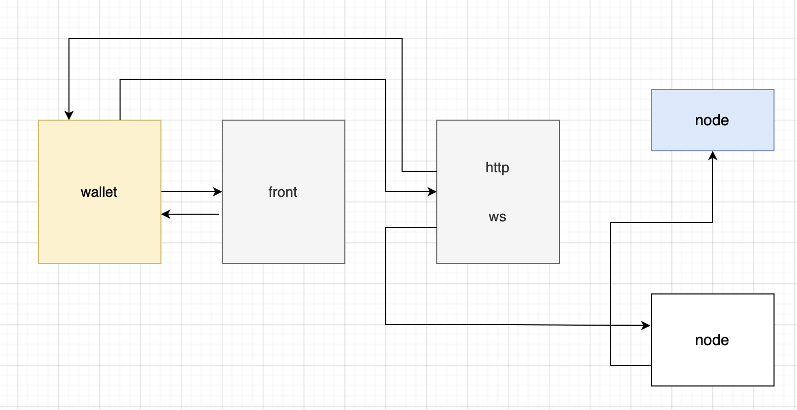

### 2305008
### network
- P2P: 클라이언트와 서버가 모두 작동되는 서버

### Ethereum bitcoin
- tcp기반으로 노드들과 통신을 진행함

### 브라우저가 노드에 있는 데이터를 가지고 오고싶다면...
브라우저가 노드에 있는 데이터를 가지고 오고 싶다면 통신을 하면 되는데
어떤 요청을 보내야할까? 노드가 http에 대한 포트와 웹소켓에 대한 포트를 
열고, 노드는 기본적으로 두개의 포트를 열어둠 웹소켓에 대한 포트, http애 대한 포트를 열어둠
tcp 포트도 열어두는데 노드들끼리의 커넥션을 위하여 열어둔다.

### 노드들은 3가지의 `port`를 가질 수 있다(클라이언트에 관련된 포트 두개와 node에 대한 포트 1개로 구성)
- HTTP, TCP: 웹브라우저 또는 `클라이언트`에 관련된 포트가 두개이다.
- WS: `node`들끼리 상호작용 할 수 있는 `port`가 1개있다.
- 하지만 비용이 많이 발생하므로 API를 사용한다.

|------------|              |------------|
|            |              |            |
|            |              ws           |
|   브라우저   |     ----->   http   노드   |
|            |              tcp          |
|------------|              |------------|


### Infra 
- switch 같은 건가..?
- blockchain노드들을 대신 돌려주고 API를 제공해준다(어느정도의 cors처리도 해줌)




### 탈중앙화와 중앙화의 차이
🚫 10:05 다시 메모할 것, 블로그에 꼭 정리하기!!
요청을 보내는 서버가 중앙화서버인가 아니면 탈중앙화 서버인가의 차이이다.

### RPC(Remote Process Call)
- http 개념안에 rpc가 속해있다
- http와 흡사하다.
- 7계층이다.
- 하나의 클라이언트이다.
- rpc의 목적: 서버가 가지고 있는 요청을 실행했는지 안했는지가 중요함

|++++++++++++|                   |++++++++++++++|
|            |                   |              |
|            |       RPC         |              |
|   client   |     ------->      |    블록마이닝   |
|            |                   |              |
|++++++++++++|                   |++++++++++++++|


### 앞으로 만들어야할 것!!
### 노드
- http서버가 필요하다, express로 구현이 가능하다.
- ws이 필요하다, 노드들의 peer(노드들이 서로간의 데이터를 주고 받을 수 있는 기능을 구현하기 위해서...)

### 클라이언트
`내가 가지고 있는 돈이 얼마가 있는지, 이 돈은 상대방에게 주고 싶다거나...`
`아주 심플한 형태의 'wallet을 구현할 것이다.`
--> 여기서 응용이 가능하다면 explorer도 구현이 가능하다.

### src > serve 디렉토리 생성
- app.ts파일 생성


### app.ts
익스프레스 사용을 위해서 설치를 해주자.
```sh
npm install express
npm install -D @types/express
```
설치가 완료되었다면 import로 불러와준다.

```ts
import express from "express"

const app express()

app.use(express.json())
// type추론이 가능하므로 req,res에 타입을 작성해주지 않아도 된다.
app.get("/", (req,res) => {
    res.send("hello chopChain")
})

export default app
```

### 클라이언트가 노드에게 account를 보내면 응답으로 balance를 받기를 원함


### ingchain.ts
block, chain, crypto, transaction, wallet에 대한 내용을 ingchain.ts에 모아놓았다.


### index.ts에서 별칭을 사용하기 위해서 아래와 같이 tsconfig.json, package.json파일을 수정해주자.
```ts
import app from "@serve/app"
```

### tsconfig.json 수정
serve추가
```json
"paths": {
            "@constants/*": ["constants/*"],
            "@core/*": ["core/*"],
            "@serve/*": ["serve/*"]
        }
```

### package.json
"^@(serve)로 수정해줌
```json
"jest": {
        "preset": "ts-jest",
        "testMatch": [
            "<rootDir>/__tests__/**/*.test.ts"
        ],
        "testEnvironment": "node",
        "moduleNameMapper": {
            "^@(serve|constants|core)/(.+)$": "<rootDir>/src/$1/$2"
        }
    },
```

### 8545포트에 요청을 보냈을 때 hello ingchain이라는 응답을 주고싶다.
```ts
import Ingchain from "@core/ingchain"
import express from "express"

// app.ts를 불러오면 빈 함수가 호출된다.
export default (web3:Ingchain) => {
    // console.log(web3)
    // get localhost:8545

    const app = express()
    app.use(express.json())

    app.get("/", (req, res) => {
        res.send("hello chopChain")
    })

    app.get("/getBalance", (req,res) => {
        // getBalance method call
        res.send("balance...")
    })
}
```

### index.ts
```ts
여기까지 실행됐을 때는 함수 값이다.
import App from "@serve/app"
```

### postman으로 post요청을 확인해보자
맥북은 요청시 localhost대신 127.0.0.1로 요청을 할 것!!
http://127.0.0.1:8545/getBalance

### 채굴을 하려면 계정을 먼저 만들어야한다.

### put, post 


### src > wallet 디렉토리 생성